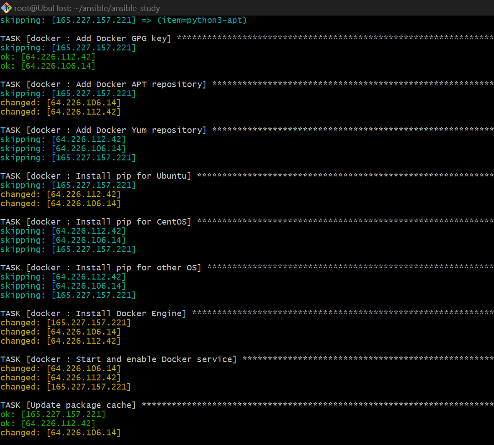

# Ansible Study

## Ansible Playbook for Server Configuration and Web Server Deployment using Multiple Roles

### Objective

This Ansible playbook aims to configure and manage three servers: two Ubuntu servers (one functioning as the host server and the other as a web server) and one CentOS server. The playbook is structured with a focus on role-based task grouping to enhance organization and management. The roles encompassed within the playbook are:

- **Script Runner Role**: Executes a bash script or custom commands on the servers as needed.

- **Apache Role**: Installs and configures Apache web server on the Ubuntu servers. Starts the Apache service and deploys web applications or static files.

- **Nginx Role**: Installs and configures Nginx web server on the CentOS server. Starts the Nginx service and deploys web applications or static files.

- **Terraform Role**: Installs Terraform on the host server and manages infrastructure deployments using Terraform.

- **Docker Role**: Installs Docker on all servers and manages containers and containerized applications.


### Playbook Execution

The playbook was executed as a unified playbook with the following structure for roles:

```yaml
---
- hosts: all
  become: true
  gather_facts: true

  tasks:
  ...

  roles:
    - script-runner
    - apache
    - nginx
    - terraform
    - docker
  ...

```

### Conclusion

Through the utilization of this Ansible playbook, the servers were efficiently configured and managed using distinct roles. The **script-runner** role successfully executed bash scripts or custom commands, while the **apache** role effectively installed and configured the Apache web server.

 

Similarly, the **nginx** role proficiently handled the installation and configuration of the Nginx web server.

 

Furthermore, the **terraform** and **docker** roles played vital roles in facilitating infrastructure management and containerization, respectively.

 

The collaborative implementation of these roles ensured streamlined server operations and comprehensive system administration.

The accompanying images provide a comprehensive visual representation of the various stages and processes involved in the server configuration and management workflow. These images showcase essential steps ranging from initial setup and connectivity to GitHub, user and server creation, and playbook executions.

The images cover a wide range of activities, including:

- Cloning Git Repositories on Servers via the Host

  

- Creation of Servers

  

- User Creation

  

- Hosting Pages via Apache

  

- Execution

 of Playbook Apache Role

  

- Execution of Playbook Docker Role

  

- Execution of Playbook Nginx Role

  

- Visualization of Playbook Roles

  

- Playbook Execution with User

  

- Execution of Playbook Terraform Role

  

- Running Scripts with Playbook

  

- Successful SSH Sign-In

  

- Testing Server Connectivity

  

- User Confirmation

  

- User Interface

  

- User Sign-In on Slave Servers

  

These images serve as valuable references and insights into the diverse processes involved in server configuration and management, enabling effective understanding and implementation of the outlined procedures.
